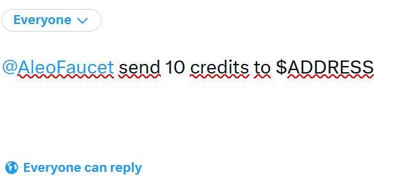
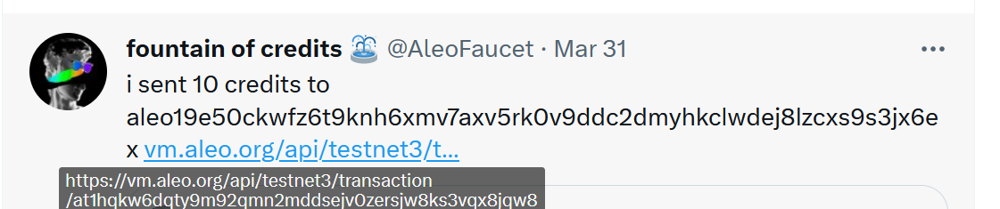

### 1. Перед началом работы необходимо установить зависимости:

apt update && apt install make clang pkg-config libssl-dev build-essential gcc xz-utils git curl vim tmux ntp jq llvm ufw -y

cd $HOME
git clone https://github.com/AleoHQ/snarkOS.git --depth 1
cd snarkOS
bash ./build_ubuntu.sh
source $HOME/.bashrc
source $HOME/.cargo/env

cd $HOME
git clone https://github.com/AleoHQ/leo.git
cd leo
cargo install --path .

### 2. Создать кошелёк здесь, если его до сих пор нет

https://aleo.tools/

### 3. Попросить токены через кран в твитере на свой адрес посредством твита 
где $ADDRESS - это Ваш Public Address от кошелька:

Ждём ответа от бота и копируем адрес транзакции:

### 4. Запустить файл aleo_deploy.sh и ввесть данные для деплоя контракта
chmod +x aleo_deploy.sh 
./aleo_deploy.sh $PK $VK $ADDRESS $QUOTE_LINK $NAME

Пример команды:
`./aleo_deploy.sh APrivateKey1z.. AViewKey1r.. aleo1l3.. https://vm.aleo.org/api/testnet3/transaction/at1.. octopus_space`

### На этом все! Мы выполнили деплой смартконтракта!